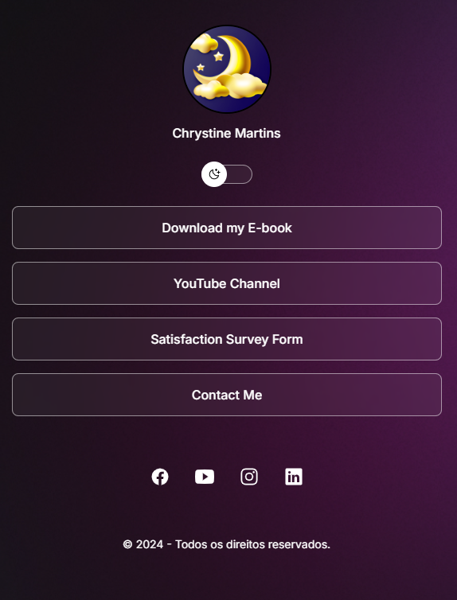
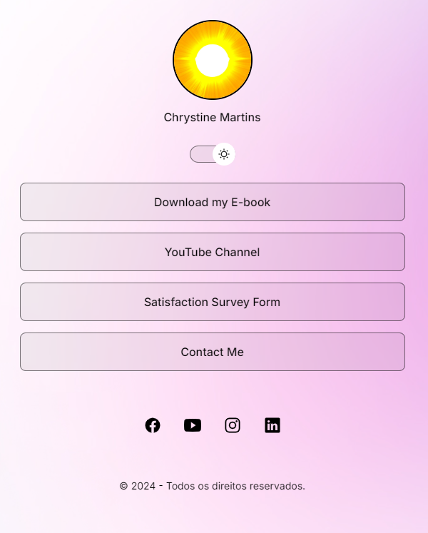

<h1 align="center"> Online Business Card </h1> 

Simple Business Card Project

  
  <a href="#-live-demo">Live Demo</a>&nbsp;&nbsp;&nbsp;|&nbsp;&nbsp;&nbsp;
  <a href="#-screenshots">Screenshots</a>&nbsp;&nbsp;&nbsp;|&nbsp;&nbsp;&nbsp;
  <a href="#-technologies">Technologies</a>&nbsp;&nbsp;&nbsp;|&nbsp;&nbsp;&nbsp;
  <a href="#-features">Features</a>&nbsp;&nbsp;&nbsp;|&nbsp;&nbsp;&nbsp;
  <a href="#-project">Project</a>&nbsp;&nbsp;&nbsp;|&nbsp;&nbsp;&nbsp;
  <a href="#-license">License</a>&nbsp;&nbsp;&nbsp;|&nbsp;&nbsp;&nbsp;
  <a href="#-contributing">Contributing</a>&nbsp;&nbsp;&nbsp;|&nbsp;&nbsp;&nbsp;
  <a href="#support">Support</a>  

  

 

## 🌐 Live Demo

  

  Tip: Use right-click → “Open in new tab”.

 

## 📸 Screenshots

  

  

## 🛠 Technologies

- HTML e CSS
- JavaScript
- Git e GitHub
- Figma

## ✨ Features

- Add links to your social media, websites, and other online resources;
- Responsive and easy-to-use interface;
- Light and dark modes with automatic switching;
- Simple and quick customization;

## 💻 Project

- The Online Business Card is a link aggregator used as an online business card. It allows you to centralize various important links in a single page, making it easier to share your information and contacts.

## 📜 License

* This project is licensed under the [MIT License](https://choosealicense.com/licenses/mit/)

 
## 🫱🏻‍🫲🏻 Contributing

 Contributions, issues, and feature requests are welcome! Please, feel free to do it! 😉 

 

<h2> Support </h2>

 If you liked it, press the Star ⭠Button, please! 😄 

